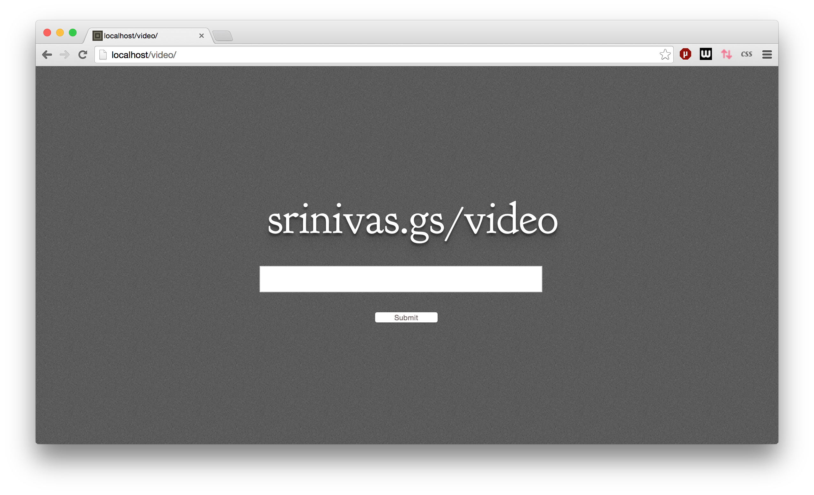
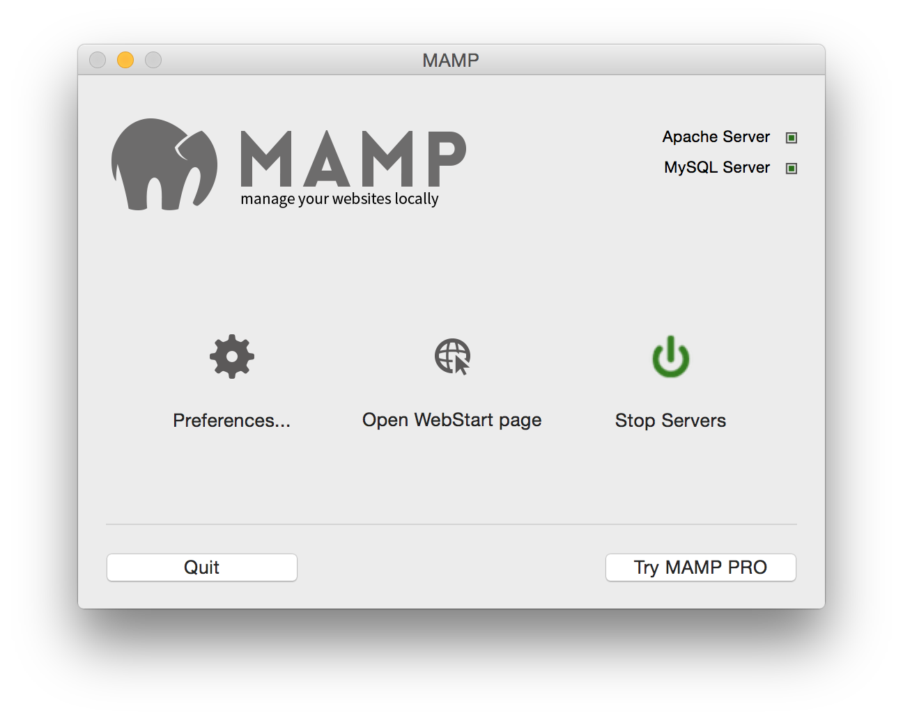
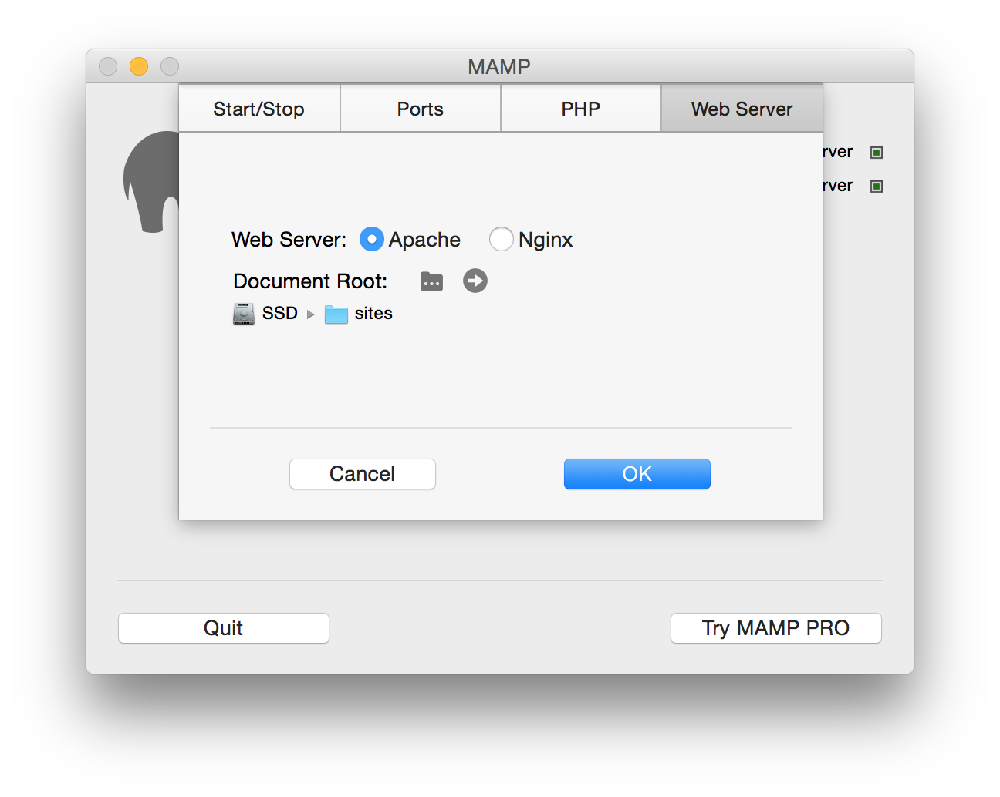

#video

This is a PHP wrapper around [youtube-dl](http://rg3.github.io/youtube-dl/). This allows you to enter a URL into a form on a server, which will download that video for you.

This is what it looks like:



#Installation

* You need a computer running Apache and PHP. The best way to do this is to install [MAMP](http://www.mamp.info/en/) (or equivalent)
* Fire up MAMP and start the servers: 
*  Figure out the folder that MAMP will serve as a website 
*  Now, copy these files there:

``` 
git clone https://github.com/sg-s/video
```

and hack away. 

#Troubleshooting

If something isn't working, uncomment these lines in `index.php` to get a verbose output:

```php
    // echo($vrl);
    // echo($cmd);
    exec($cmd, $output, $ret);
    // echo 'Output : ';
    // var_export($output);
    // echo "\nReturn : ";

```

If you see an error saying about permissions being denied, you have to 

```
chmod 777 video
```

# Credits

Now also strips a MP3 from the video, with this [fix](https://github.com/rg3/youtube-dl/issues/1742)